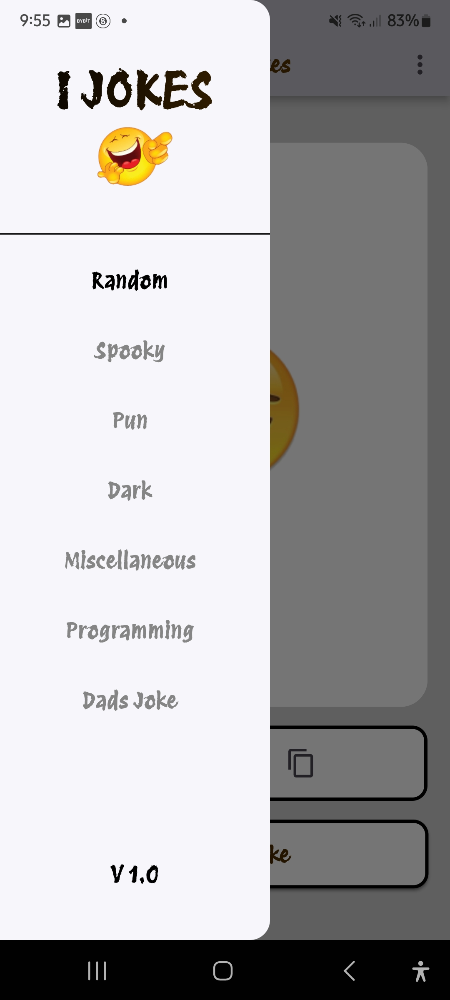
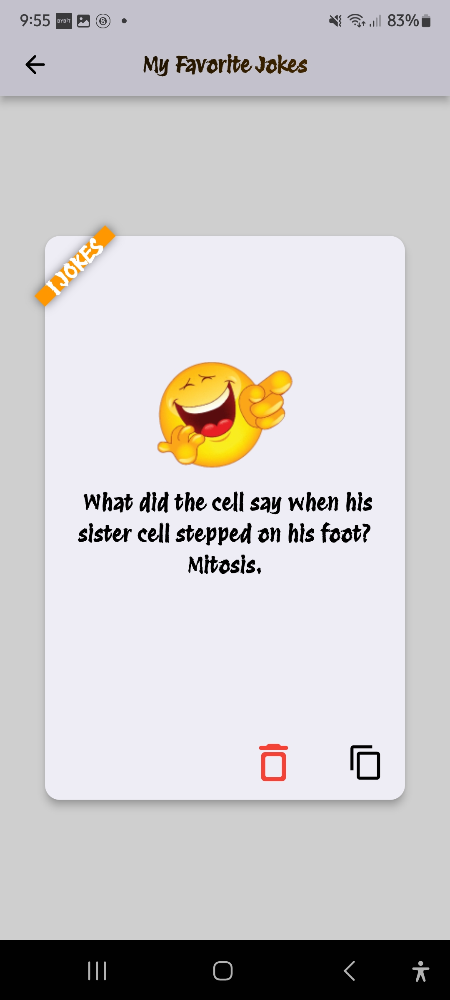

# 🤣 Joke App

A fun and engaging Flutter application that delivers random jokes, allows users to categorize their humor, save favorites, and share laughs with friends!

## About the App

The Joke App is designed to bring a smile to your face. It offers a seamless experience for Browse a wide variety of jokes. You can:

* **Get Random Jokes:** Instantly fetch new jokes with a tap.
* **Choose Joke Categories:** Filter jokes by type (e.g., programming, dad jokes, general) to match your mood.
* **Favorite Jokes:** Save your most loved jokes to a dedicated favorites section for easy access anytime.
* **Share Jokes:** Spread the laughter by sharing jokes directly from the app to your friends via various platforms.

## App Screenshots

Here are some glimpses of the Joke App in action:

| Screen              | Screenshot                                       | Description                                     |
| :------------------ | :----------------------------------------------- | :---------------------------------------------- |
| **Splash Screen** |   | The initial loading screen when the app starts. |
| **Home View** |     | The main screen where random jokes are displayed. |
| **Home View 2** |     | Showing how a joke is presented to the user.    |
| **Joke Categories** |  | The screen to select different joke types.      |
| **Favorite Jokes** |  | Where all your saved jokes reside.              |


## Getting Started

This project is a Flutter application. To get a copy up and running on your local machine for development and testing, follow the steps below.

### Prerequisites

Before you can run this app, you'll need to have the following software installed on your system:

* **Git:** For cloning the repository.
    * [Download Git](https://git-scm.com/downloads)
* **Flutter SDK:** The framework used to build this application.
    * [Install Flutter](https://flutter.dev/docs/get-started/install)

### Installation and Local Setup

Follow these simple steps to set up and run the Joke App locally:

1.  **Clone the Repository:**
    Open your terminal or command prompt and run the following command to clone the project repository to your local machine:

    ```bash
    git clone [https://github.com/Isaiahcodes-3321/JokeApp.git](https://github.com/Isaiahcodes-3321/JokeApp.git)
    ```

2.  **Navigate to the Project Directory:**
    Change your current working directory to the newly cloned project folder:

    ```bash
    cd joke_app
    ```

3.  **Install Dependencies:**
    Flutter projects rely on various packages. Fetch all the necessary dependencies by running:

    ```bash
    flutter pub get
    ```

4.  **Run the Application:**
    Ensure you have a device connected (physical Android/iOS device, Android Emulator, or iOS Simulator) or run it in a web browser/desktop. Then, execute the following command to build and launch the app:

    ```bash
    flutter run
    ```

    The app should now be running on your chosen device or platform!


